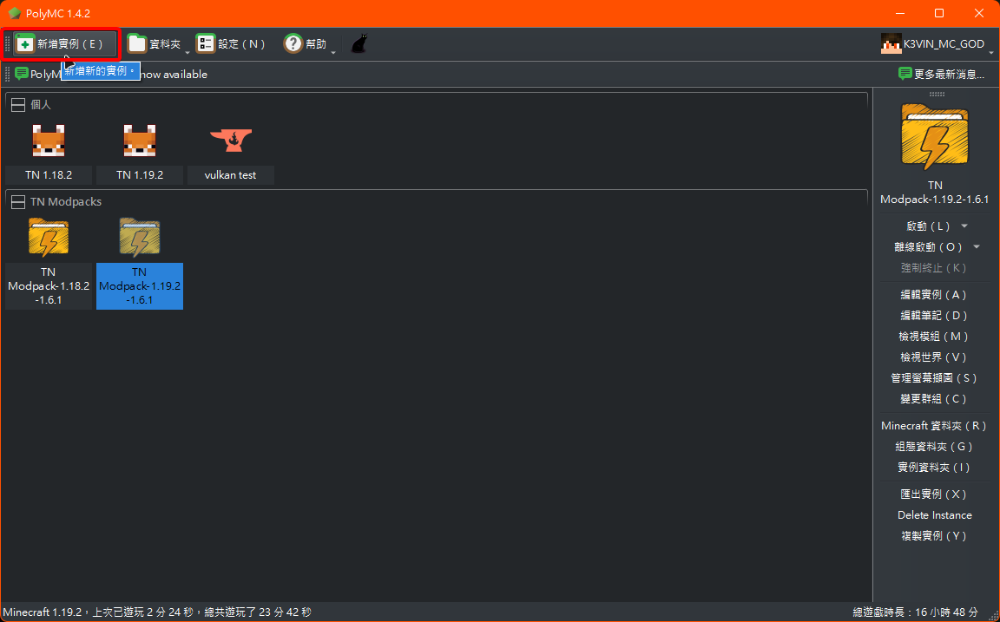
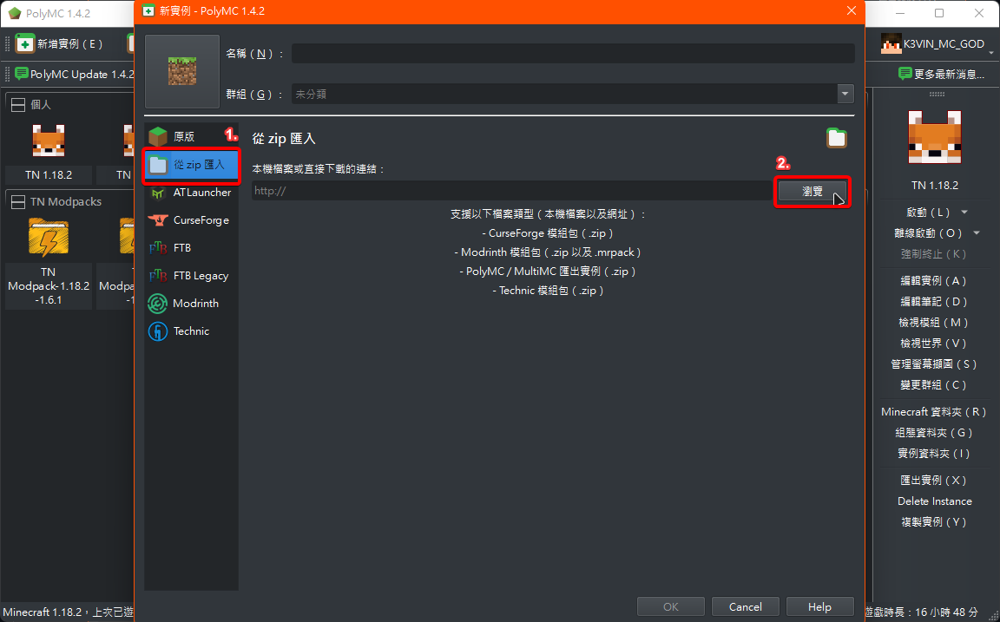
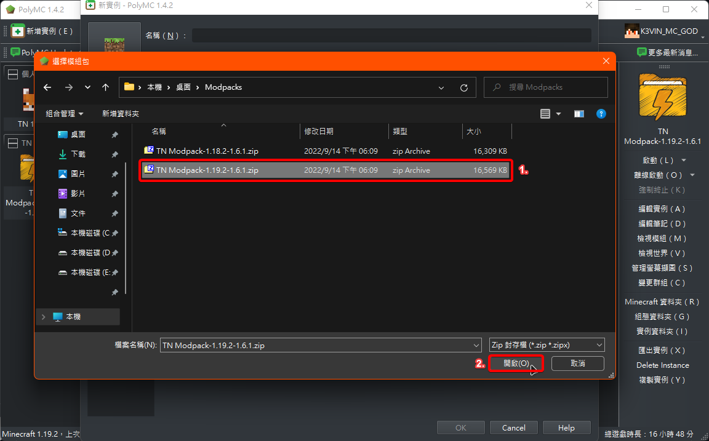
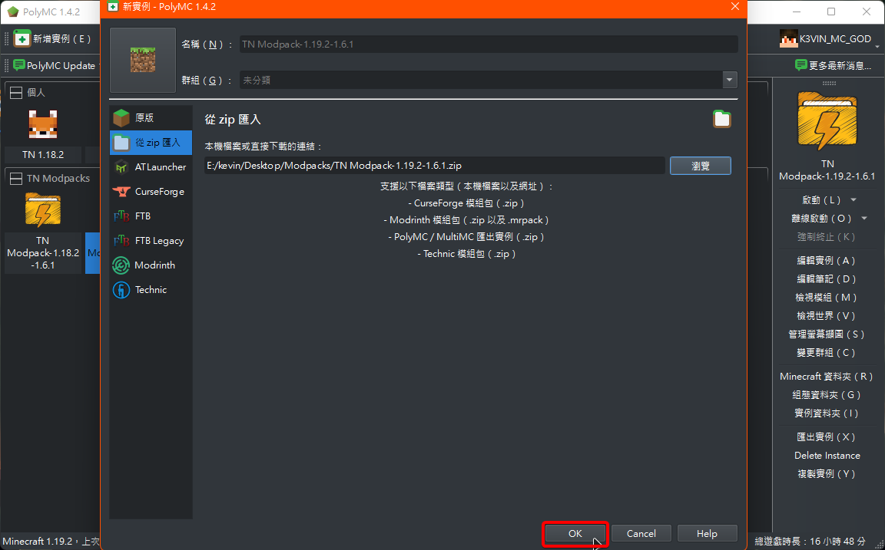

# TN VanillaBoostPack | 一個可以大幅提升原版Minecraft效能的模組包

- [TN VanillaBoostPack | 一個可以大幅提升原版Minecraft效能的模組包](#tn-vanillaboostpack--一個可以大幅提升原版minecraft效能的模組包)
  - [模組列表](#模組列表)
  - [安裝方式：](#安裝方式)

---

## 模組列表

Google Sheet: [>> Click Me <<](https://docs.google.com/spreadsheets/d/1xkfMznuglSiO3qweUCxzBD2HT56MNTea/)
|版本|名稱|作者|敘述|載點|
|---|---|---|---|---|
|1.18.2、1.19.2|Alternate Current|SpaceWalkerRS|預載紅石信號處理來優化原版紅石信號卡頓|[CurseForge](https://www.curseforge.com/minecraft/mc-mods/alternate-current)|
|1.18.2、1.19.2|AttributeFix|DarkhaxDev|優化原版傷害計算|[CurseForge](https://www.curseforge.com/minecraft/mc-mods/attributefix)|
|1.18.2、1.19.2|Better Beds|Motschen|優化床的渲染，解決大量的床導致的卡頓問題|[CurseForge](https://www.curseforge.com/minecraft/mc-mods/better-beds)|
|1.18.2、1.19.2|BetterF3|cominixo|優化原版除錯（F3介面）|[CurseForge](https://www.curseforge.com/minecraft/mc-mods/betterf3)|
|1.18.2、1.19.2|Clumps|Jaredlll08|優化原版經驗球過多導致玩家吸收緩慢的問題|[CurseForge](https://www.curseforge.com/minecraft/mc-mods/clumps)|
|1.18.2、1.19.2|ConnectivityForge/Fabric|someaddon|修復連線問題|[CurseForge](https://www.curseforge.com/minecraft/mc-mods/connectivity)|
|1.18.2、1.19.2|Continuity|Pepper_Bell|材質連接，例如玻璃等|[CurseForge](https://www.curseforge.com/minecraft/mc-mods/continuity)|
|1.18.2、1.19.2|Cull Leaves|Motschen|優化樹葉渲染，解決大量樹葉造成的卡頓|[CurseForge](https://www.curseforge.com/minecraft/mc-mods/cull-leaves)|
|1.18.2、1.19.2|DashLoader|notequalalpha|通過預載麥塊資源來加速載入|[CurseForge](https://www.curseforge.com/minecraft/mc-mods/dashloader)|
|1.18.2、1.19.2|Debugify|XanderIsDev|修正大量原版麥塊錯誤|[CurseForge](https://www.curseforge.com/minecraft/mc-mods/debugify)|
|1.18.2、1.19.2|Enhanced Block Entities|FoundationGames|透過更改實體（如：箱子、告示牌）的渲染方式來提升效能)|[CurseForge](https://www.curseforge.com/minecraft/mc-mods/enhanced-block-entities)|
|1.18.2、1.19.2|Entity Culling Fabric/Forge|tr9zw|優化實體渲染，解決大量實體造成的卡頓|[CurseForge](https://www.curseforge.com/minecraft/mc-mods/entityculling)|
|1.18.2、1.19.2|Fastload|overloadedwithmods|大量減少世界載入所需要的時間|[CurseForge](https://www.curseforge.com/minecraft/mc-mods/fastload)|
|1.18.2、1.19.2|FerriteCore (Fabric)|malte0811|減少記憶體佔用|[CurseForge](https://www.curseforge.com/minecraft/mc-mods/ferritecore-fabric)|
|1.18.2、1.19.2|Iris Shaders|coderbot|適用於Sodium的光影模組|[CurseForge](https://www.curseforge.com/minecraft/mc-mods/irisshaders)|
|1.18.2、1.19.2|Item Model Fix|Pepper_Bell|修復原版貼圖空隙問題|[CurseForge](https://www.curseforge.com/minecraft/mc-mods/item-model-fix)|
|1.18.2、1.19.2|Krypton|tuxed|優化網路堆疊|[CurseForge](https://www.curseforge.com/minecraft/mc-mods/krypton)|
|1.18.2、1.19.2|LazyDFU|tuxed|優化資料格式轉換器（DataFixerUpper）|[CurseForge](https://www.curseforge.com/minecraft/mc-mods/lazydfu)|
|1.18.2、1.19.2|Lithium (Fabric)|jellysquid3_|優化原版遊戲引擎|[CurseForge](https://www.curseforge.com/minecraft/mc-mods/lithium)|
|1.18.2、1.19.2|MemoryLeakFix|FX_PR0CESS|修復原版麥塊記憶體溢出問題|[CurseForge](https://www.curseforge.com/minecraft/mc-mods/memoryleakfix)|
|1.18.2、1.19.2|Mod Menu|ProspectorDev|模組選單|[CurseForge](https://www.curseforge.com/minecraft/mc-mods/modmenu)|
|1.18.2、1.19.2|Not Enough Crashes (Fabric)|NatanFudge|優化遊戲崩潰的除錯介面|[CurseForge](https://www.curseforge.com/minecraft/mc-mods/not-enough-crashes)|
|1.18.2、1.19.2|Recipe Cache|biom4st3r1|緩存工作臺及熔爐的配方搜尋，減少因堆疊與熔爐tick的伺服器延遲|[CurseForge](https://www.curseforge.com/minecraft/mc-mods/recipe-cache)|
|1.18.2、1.19.2|Reese's Sodium Options|FlashyReese|優化Sodium的設定介面|[CurseForge](https://www.curseforge.com/minecraft/mc-mods/reeses-sodium-options)|
|1.18.2、1.19.2|Server Performance - Smooth Chunk SaveForge/Fabric|someaddon|減緩一次儲存太多區塊所造成的卡頓|[CurseForge](https://www.curseforge.com/minecraft/mc-mods/smooth-chunk-save)|
|1.18.2、1.19.2|ServerCore|Wesley8081|優化伺服器卡頓|[CurseForge](https://www.curseforge.com/minecraft/mc-mods/servercore)|
|1.18.2、1.19.2|Smooth Boot (Fabric)|UltimateBoomer|修復8核以下處理器在開啟麥塊時100%滿載|[CurseForge](https://www.curseforge.com/minecraft/mc-mods/smooth-boot)|
|1.18.2、1.19.2|Sodium Extra|FlashyReese|Sodium的擴展設定|[CurseForge](https://www.curseforge.com/minecraft/mc-mods/sodium-extra)|
|1.18.2、1.19.2|Sodium|jellysquid3_|透過讓麥塊使用更新的OpenGL API來提升效能|[CurseForge](https://www.curseforge.com/minecraft/mc-mods/sodium)|
|1.18.2、1.19.2|Starlight (Fabric)|Spottedstar|優化以及修復原版麥塊的光照引擎|[CurseForge](https://www.curseforge.com/minecraft/mc-mods/vmp-fabric)|
|1.18.2、1.19.2|Very Many Players (Fabric)|ishlandmc|優化玩家渲染，修復伺服器有大量玩家時的卡頓|[CurseForge](https://www.curseforge.com/minecraft/mc-mods/vmp-fabric)|
|1.18.2、1.19.2|WI Zoom|alexander9892|像Optifine一樣可以一鍵放大畫面|[CurseForge](https://www.curseforge.com/minecraft/mc-mods/wi-zoom)|

---

## 安裝方式：

  
  
  

